<!-- .element overrides and per-slide classes are applied via <div> wrappers.
     This file is the single source of truth for the deck and doubles as a
     readable Markdown walkthrough of the talk. -->

<div class="title-slide">

<span class="kicker">.NET + AI</span>

# From Models to Agents

<p class="subtitle">The Essential Building Blocks of AI Apps</p>

<div class="title-rule"></div>

<p class="byline">Luis Quintanilla &nbsp;·&nbsp; .NET team, Microsoft</p>

</div>

Note:
Hey everyone, thanks for joining. Today I want to take the mystery out of building AI apps in .NET.
The short version: you already know how to do this. The AI features you keep hearing about are just building blocks, and they live right where the rest of your .NET app lives.
We'll start small, with code you can run, and stack the blocks one at a time until we land on agents. Then I'll show you the production template that ties it all together.

---

<span class="kicker">The problem</span>

## "Just call a model," they said

<div class="cols">
<div class="col-left">

Real AI features need more than one call:

- a model, and the freedom to change it
- your data, retrieved and grounded
- tools and actions
- caching, retries, telemetry
- a way to know it's any good
- and sometimes, agents

</div>
<div class="col-left">

Today that means stitching SDKs from different ecosystems, each with its own shape.

<p class="lead">The .NET team shipped these as composable building blocks so you don't have to.</p>

</div>
</div>

Note:
Here's the trap. Everybody's first AI demo is one call to a model. Looks easy.
Then the real work shows up. You want to swap the model when a cheaper one lands. You want answers grounded in your data. You want tools, caching, telemetry, and some way to prove the thing actually works.
The usual path is gluing together half a dozen libraries from different worlds. The .NET team's answer is to ship these as building blocks that snap together. That's what the next 40 minutes is about.

---

<span class="kicker">Built the .NET way</span>

## AI primitives, native to .NET

<div class="diagram">
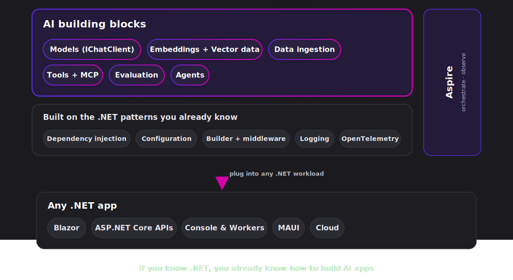
</div>

Note:
Here's the shape of the whole talk. Every AI app needs the same handful of primitives: a way to talk to models, to represent and search data, to call tools, to observe, to evaluate, and to orchestrate agents. .NET ships those primitives as building blocks, and they're built the way you already work.
Same DI registration. Same builder pattern. Same middleware idea from ASP.NET Core. Same IConfiguration and user-secrets. Same ILogger, same OpenTelemetry. Aspire orchestrates all of it.
So your .NET skills carry straight over. That's the message for the whole talk: if you know .NET, you already know how to build AI apps.

---

<span class="kicker">The map</span>

## Six blocks, one foundation

<div class="diagram">
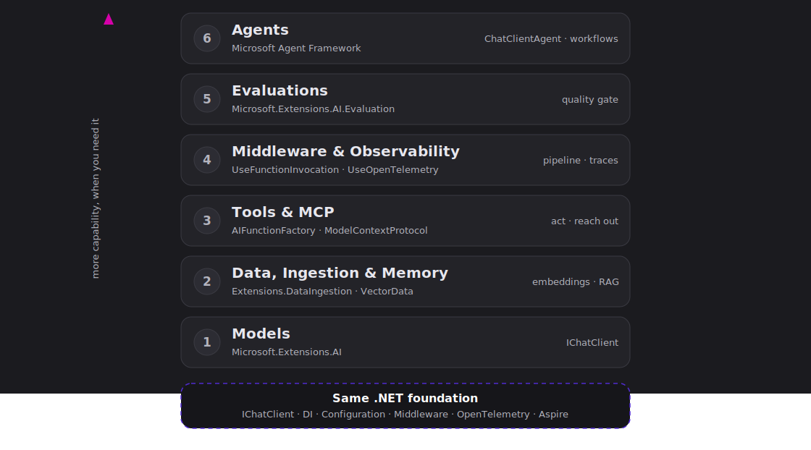
</div>

<p class="muted small">We'll light up one block at a time, and prove each with a tiny app you can run.</p>

Note:
This is our map. Six blocks. Models at the bottom, agents at the top, and everything resting on one shared foundation, IChatClient.
The plan is simple: we add a block only when the problem asks for it. Start with the simplest thing that works, then graduate.
And every block gets a tiny runnable sample. Single C# file, dotnet run, real output. No magic, no big project to set up.

---

<span class="kicker">The .NET team's role</span>

## We build the seams. You build the app.

<div class="cols">
<div class="col-left">

**What we ship**

- The open abstractions we author: `IChatClient`, `IEmbeddingGenerator`, `Microsoft.Extensions.VectorData`
- First-class support for open standards we didn't invent: MCP (Anthropic), OpenTelemetry (CNCF)
- The seam itself, so the ecosystem plugs in

<p class="muted small">Providers and stores stay with their owners and line up behind the same abstractions: OpenAI, Azure, Ollama, Qdrant, and more. The same playbook as `ILogger`, EF Core providers, and ASP.NET Core middleware: the platform defines the contract, the ecosystem fills it.</p>

</div>
<div class="col-left">

**What you get**

- No lock-in: swap the model, provider, or store without a rewrite
- Your .NET skills carry over: DI, the builder, middleware, Aspire
- Best-of-breed pieces behind one interface
- Open standards, not a silo

</div>
</div>

<p class="lead">We steward the platform and enable the ecosystem, so your code keeps working as the AI space moves.</p>

Note:
Before we stack a single block, one slide on the why, and on our job on the .NET team. Our role is to ship the seams: the interfaces we author, like IChatClient, IEmbeddingGenerator, and the vector data abstraction, plus first-class support for the open standards we didn't invent, MCP from Anthropic and OpenTelemetry from the CNCF. We don't ship the only model or the only store. We ship the contract, and the providers stay with their owners and line up behind it, OpenAI, Azure, Ollama, Qdrant, and the rest.
If that sounds familiar, it's exactly what we did with ILogger, with configuration, with EF Core providers, with ASP.NET Core middleware. The platform defines the seam, the ecosystem fills it.
And here's what that gives you. No lock-in: you swap the model, the provider, or the store without a rewrite. Your .NET skills carry straight over. You get best-of-breed pieces behind one interface, built on open standards, not a silo. Our job is to steward the platform and enable the ecosystem, so the code you write today keeps working as this space keeps moving. That's the promise behind every block we're about to build.

---

<span class="kicker">Block 1 · Models</span>

## One interface for every provider

<div class="cols narrow-left">
<div class="col-left">

`IChatClient` is the foundation. Talk to GitHub Models, Azure OpenAI, OpenAI, Ollama, or Foundry Local through the same interface.

<div class="badges">
<span class="badge ext">Microsoft.Extensions.AI</span>
<span class="badge">provider-agnostic</span>
</div>

<span class="run">dotnet run 01-chat.cs</span>

</div>
<div class="col-left">

```csharp
OpenAIClient provider = new(
    new ApiKeyCredential(token),
    new() { Endpoint = new Uri("https://models.inference.ai.azure.com") });

IChatClient chat = provider
    .GetChatClient("gpt-4o-mini")
    .AsIChatClient();

ChatResponse response =
    await chat.GetResponseAsync("In one sentence, what is .NET?");
```

</div>
</div>

<p class="repeat-beat">Familiar .NET pattern · simplest thing that works · interoperable · same foundation</p>

Note:
Block one, models. The only provider-specific lines are the two that build the client. Everything after sees IChatClient and nothing else.
Want a different model? Change the string. Different provider? Change those two lines. The rest of your app doesn't move. That's the interop promise, and it's the foundation the other five blocks sit on.
Run the sample and you'll see the same code answer with gpt-4o-mini and then gpt-4o, no other changes.

--

<span class="kicker">Block 1 · Multimodal</span>

## Models aren't just text

<div class="cols">
<div class="col-left">

The same `IChatClient` takes images, not just text. Add an image content part and ask about it.

<span class="run">dotnet run 02-vision.cs</span>

Need a picture *out*? `IImageGenerator` is the same one-interface pattern.

<span class="run">dotnet run 03-image-generation.cs</span>

<p class="muted small">Speech-to-text (`ISpeechToTextClient`) is the same pattern. Real-time audio is available today through the provider SDK.</p>

</div>
<div class="col-left">

```csharp
ChatMessage msg = new(ChatRole.User,
[
    new TextContent("What's in this image?"),
    new UriContent(url, "image/jpeg")
]);

ChatResponse seen = await chat.GetResponseAsync([msg]);

// a picture out, same kind of interface
IImageGenerator images = provider
    .GetImageClient("dall-e-3").AsIImageGenerator();
```

</div>
</div>

<p class="repeat-beat">Familiar .NET pattern · simplest thing that works · interoperable · same foundation</p>

Note:
Quick one, but it matters. The Models block isn't text-only. The same IChatClient takes images. You build a message with a text part and an image part, hand it over, and ask about the picture. gpt-4o-mini does vision, so that runs on GitHub Models.
And it goes the other way too. Need an image generated? That's IImageGenerator, the same one-interface, swap-the-provider pattern. Speech-to-text is ISpeechToTextClient, same idea. Real-time audio you can do today through the provider SDK.
So when I say "models," I mean text, images, and audio, all through the same kind of seam. One pattern, every modality.

--

<div class="diagram">
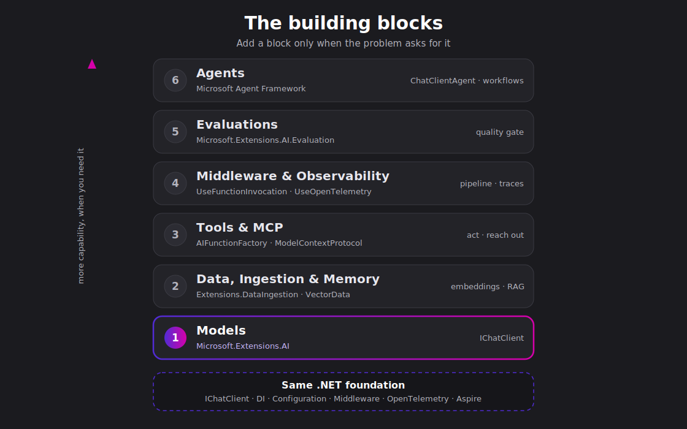
</div>

Note:
One block lit. Models. Hold this picture in your head, because we're going to add to it the rest of the talk.

---

<span class="kicker">Block 2 · Data &amp; memory</span>

## Embeddings: match on meaning

<div class="cols">
<div class="col-left">

`IEmbeddingGenerator` is the same idea as `IChatClient`: one interface, any provider. Turn text into vectors, compare by cosine similarity.

<span class="run">dotnet run 04-embeddings.cs</span>

<p class="primer-cue">New to embeddings? Take the 20-second detour.</p>

</div>
<div class="col-left">

```csharp
IEmbeddingGenerator<string, Embedding<float>> embedder =
    provider.GetEmbeddingClient("text-embedding-3-small")
            .AsIEmbeddingGenerator();

Embedding<float> a = await embedder.GenerateAsync(
    "I build apps with .NET.");
Embedding<float> b = await embedder.GenerateAsync(
    ".NET is a developer platform.");

float score = TensorPrimitives.CosineSimilarity(
    a.Vector.Span, b.Vector.Span);
```

</div>
</div>

Note:
Block two is data and memory, and it starts with embeddings. Models match on meaning, not keywords. So you turn text into vectors and compare them.
Notice the interface. IEmbeddingGenerator is the exact same pattern as IChatClient. One interface, swap the provider underneath. The cosine similarity helper ships in the box with .NET.
Closer meaning, higher score. That one idea is what powers search and RAG, which is the next slide.

--

<span class="kicker">Block 2 · In plain terms</span>

## What's an embedding?

<div class="diagram">
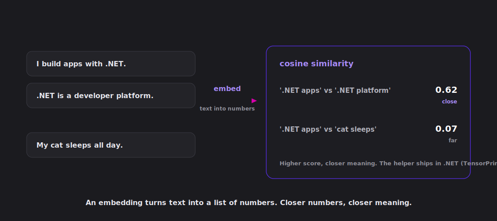
</div>

Note:
Quick detour for anyone new to this. An embedding turns text into a vector, which is just a point in space. Phrases with similar meaning land near each other, so '.NET apps' and '.NET platform' cluster together and 'cat sleeps' sits far away. Cosine similarity turns that distance into one number from zero to one, and the helper ships in .NET. That's the whole idea. Now back to the code.

--

<span class="kicker">Block 2 · RAG</span>

## Retrieve, augment, generate

<div class="cols">
<div class="col-left">

`Microsoft.Extensions.VectorData` is the storage abstraction. Code against it once, swap the store like you swap an EF Core provider.

<div class="badges">
<span class="badge ext">Microsoft.Extensions.VectorData</span>
<span class="badge">in-memory → Qdrant → Azure AI Search</span>
</div>

<span class="run">dotnet run 05-rag.cs</span>

<p class="primer-cue">New to RAG? Take the 20-second detour.</p>

</div>
<div class="col-left">

```csharp
await foreach (VectorSearchResult<Doc> hit in
    docs.SearchAsync(queryVector.Vector, top: 2))
{
    retrieved.Add(hit.Record.Text);
}
string context = string.Join("\n", retrieved);

ChatResponse answer = await chat.GetResponseAsync(
    $"Answer using only these facts:\n{context}\n\n" +
    $"Question: {question}");
```

</div>
</div>

<p class="repeat-beat">Familiar .NET pattern · simplest thing that works · interoperable · same foundation</p>

Note:
Now use those vectors. RAG is three steps: retrieve the closest text, augment the prompt with it, generate the answer.
The storage sits behind Microsoft.Extensions.VectorData. In the sample it's the in-memory store. To move to Qdrant, Azure AI Search, Redis, or SQLite, you change the store and the rest of this code stays put. Same story as switching an EF Core provider.
This is exactly how the chat template grounds its answers, and we'll see that later.

--

<span class="kicker">Block 2 · In plain terms</span>

## What's RAG?

<div class="diagram">
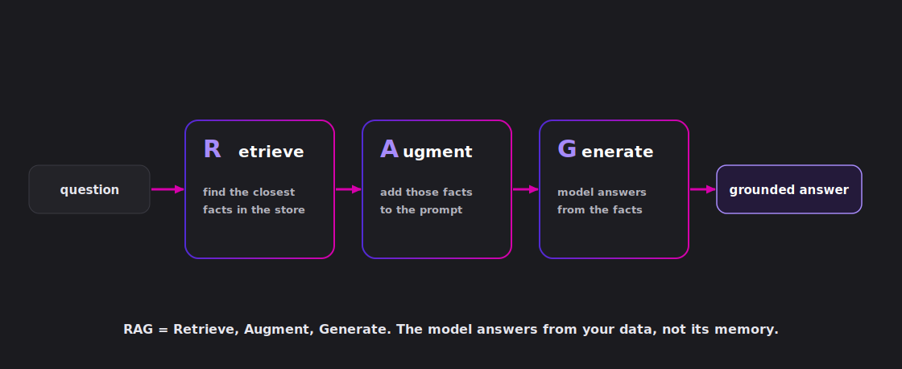
</div>

Note:
If RAG is a new term, here's the whole idea in one picture. The model doesn't know your data, so you do three things. Retrieve the closest facts from your store. Augment the prompt by pasting those facts in. Generate the answer from them. Retrieve, augment, generate, that's the name. The answer is grounded in your data instead of the model's memory. Now the code.

--

<div class="diagram">
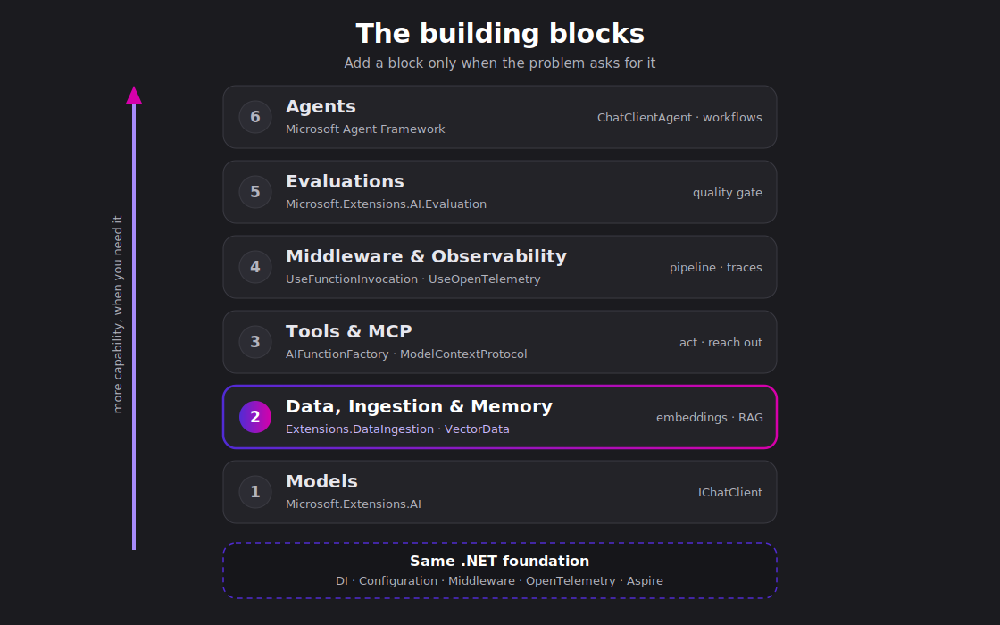
</div>

Note:
Two blocks lit. Models, plus data and memory. The picture is filling in.

---

<span class="kicker">Block 3 · Tools</span>

## Let the model run your code

<div class="cols">
<div class="col-left">

`AIFunctionFactory` wraps a normal C# method as a tool. `UseFunctionInvocation` runs it when the model asks, then feeds the result back.

<span class="run">dotnet run 06-tools.cs</span>

<p class="primer-cue">New to function calling? Take the 20-second detour.</p>

</div>
<div class="col-left">

```csharp
IChatClient chat = inner.AsBuilder()
    .UseFunctionInvocation()
    .Build();

[Description("Days until a month/day this year.")]
int DaysUntil(int month, int day) => /* ... */;

ChatOptions options = new()
{
    Tools = [AIFunctionFactory.Create(DaysUntil)]
};

await chat.GetResponseAsync(prompt, options);
```

</div>
</div>

Note:
Block three, tools. A model reasons about text but it can't read a clock or call your API. So you hand it tools.
AIFunctionFactory turns a plain C# method into a tool. The method name, the parameter names, and the Description attribute become the schema the model sees. Name things clearly.
And look how tools turn on: AsBuilder, UseFunctionInvocation, Build. That's the ASP.NET Core builder pattern. You wrote plain methods, the model called them. We never called them ourselves.

--

<span class="kicker">Block 3 · In plain terms</span>

## Does the model run your code?

<div class="diagram">
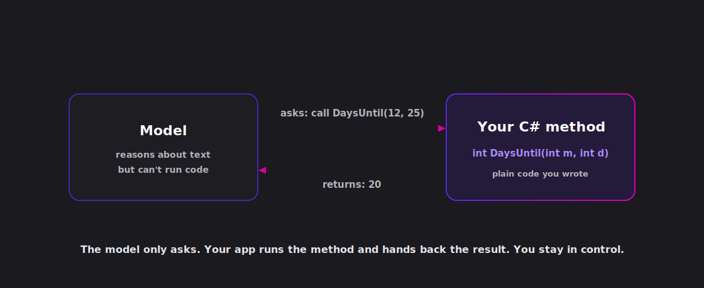
</div>

Note:
One thing that trips people up: the model never runs your code. Here's what actually happens. The model reads your tools and decides it needs one, so it asks, call DaysUntil with twelve and twenty-five. Your app runs the method and hands back the result, twenty. The model takes that and writes the answer. You wrote the method, you stayed in control, the model just asked. Now the code.

--

<span class="kicker">Block 3 · MCP</span>

## One open standard for every tool

<div class="cols">
<div class="col-left">

Model Context Protocol is "HTTP for tools." A server exposes tools once, any client uses them. An MCP tool is just an `AIFunction`.

<div class="badges">
<span class="badge open">open standard</span>
<span class="badge">consume &amp; serve</span>
</div>

<span class="run">dotnet run 07-mcp.cs</span>

<p class="primer-cue">New to MCP? Take the 20-second detour.</p>

</div>
<div class="col-left">

```csharp
await using McpClient learn =
    await McpClient.CreateAsync(new HttpClientTransport(new()
    {
        Endpoint = new Uri("https://learn.microsoft.com/api/mcp"),
        Name = "Microsoft Learn"
    }));

IList<McpClientTool> tools = await learn.ListToolsAsync();

await chat.GetResponseAsync(question,
    new ChatOptions { Tools = [.. tools] });
```

</div>
</div>

<p class="repeat-beat">Familiar .NET pattern · simplest thing that works · interoperable · same foundation</p>

Note:
Writing a tool for every system doesn't scale. MCP is the open standard that fixes that. Think of it as HTTP for tools. A server publishes its tools once, and any MCP client can use them.
Here we connect to the public Microsoft Learn server, list its tools, and the model searches the docs for us.
And the payoff is the interop. An MCP tool is just an AIFunction. It drops straight into the same Tools list from the previous slide. No new concept. .NET can consume MCP tools and serve them too.

--

<span class="kicker">Block 3 · In plain terms</span>

## What's MCP?

<div class="diagram">
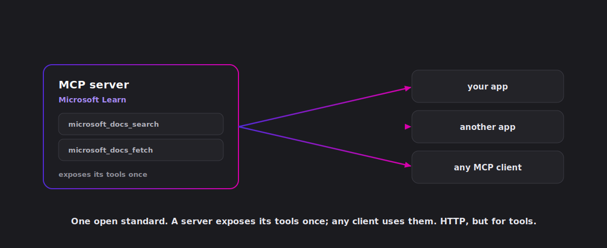
</div>

Note:
If MCP is new to you, the people who made it describe it as a USB-C port for AI. One open standard, and your app, the client, plugs into any tool server. Here that server is the public Microsoft Learn one, exposing docs search and fetch. Swap in GitHub, your own server, or hundreds of others and the protocol is the same, so you build the connector once and integrate everywhere. And the payoff: each tool arrives as just an AIFunction, the same thing from the tools slide. Now the code.

--

<div class="diagram">
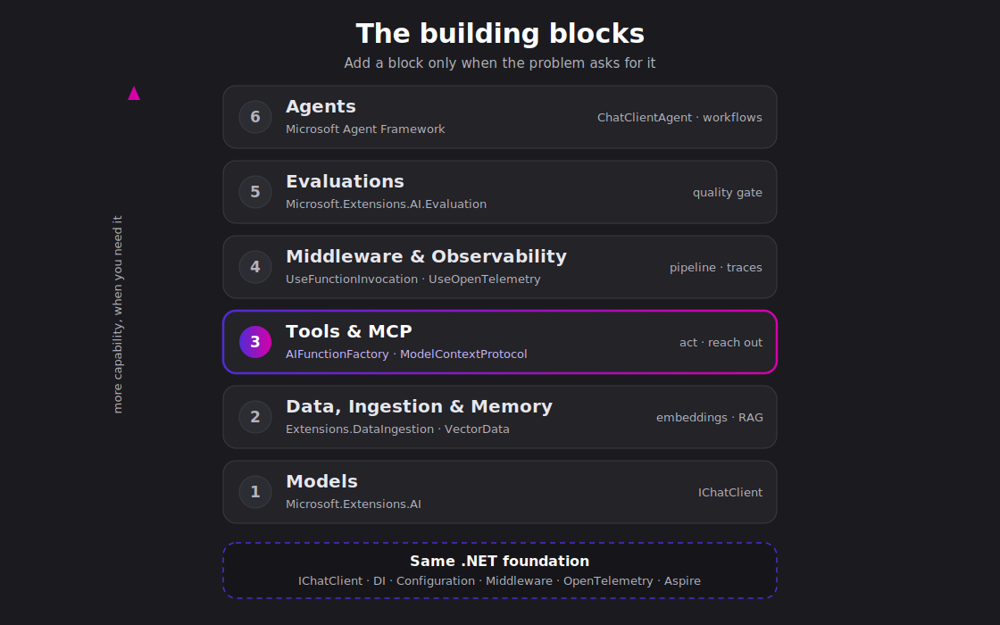
</div>

Note:
Three blocks. Models, data, tools. We can already build something real. But real means production, and that's the next block.

---

<span class="kicker">Block 4 · Middleware</span>

## `IChatClient` is a pipeline

<div class="cols">
<div class="col-left">

Exactly like the ASP.NET Core request pipeline. Wrap the client and each piece does one job: function invocation, caching, telemetry.

<div class="badges">
<span class="badge open">OpenTelemetry</span>
<span class="badge">Aspire dashboard</span>
</div>

<span class="run">dotnet run 08-middleware.cs</span>

</div>
<div class="col-left">

```csharp
IChatClient chat = inner.AsBuilder()
    .UseFunctionInvocation()
    .UseDistributedCache(cache)
    .UseOpenTelemetry(sourceName: name)
    .Build();
```

<p class="muted small">Add a line to add a behavior. Remove a line to remove it.</p>

</div>
</div>

Note:
Block four, middleware and observability. Production needs more than a raw call. Caching, retries, telemetry, function invocation.
IChatClient is a pipeline, the same shape as the ASP.NET Core request pipeline. Read it top to bottom: invoke tools, then cache, then trace, then the real client.
Caching means a repeated prompt skips the model the second time. Telemetry is OpenTelemetry, vendor-neutral, so those traces show up in the Aspire dashboard or any backend you like. Add a line to add a behavior. That's the whole model.

--

<div class="diagram">
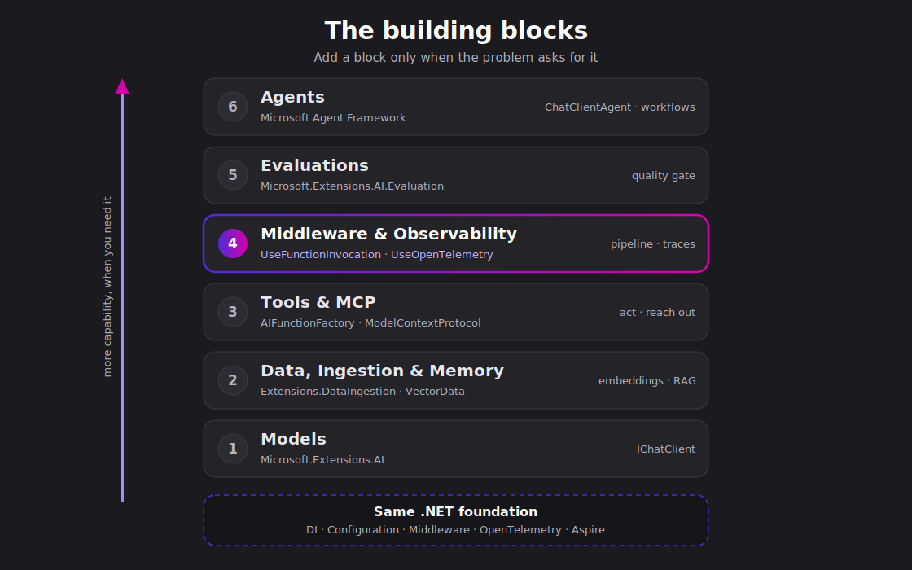
</div>

Note:
Four blocks lit. Now we can ship it. But how do we know it's good, and how do we keep it good? That's block five.

---

<span class="kicker">Block 5 · Evaluations</span>

## Know it's good. Stay good.

<div class="cols">
<div class="col-left">

`Microsoft.Extensions.AI.Evaluation` scores responses with evaluators that use an `IChatClient` as the judge. Same foundation.

This block isn't in the template. You add it in your **test project and CI**.

<span class="run">dotnet run 09-eval.cs</span>

<p class="primer-cue">A model grading a model? Take the 20-second detour.</p>

</div>
<div class="col-left">

```csharp
IEvaluator evaluators = new CompositeEvaluator(
    new RelevanceEvaluator(),
    new CoherenceEvaluator(),
    new GroundednessEvaluator());

EvaluationResult result = await evaluators.EvaluateAsync(
    conversation, modelResponse, judge,
    additionalContext: [grounding]);

NumericMetric m = result.Get<NumericMetric>(name);
// m.Value: 4.0/5  (m.Interpretation?.Rating)
```

</div>
</div>

<p class="repeat-beat">Familiar .NET pattern · simplest thing that works · interoperable · same foundation</p>

Note:
Block five, evaluations. This is the quality gate, and it's the one people skip until it bites them.
You score the response. Relevance, coherence, groundedness, and more. The evaluators use an IChatClient as the judge, so it's the same foundation again, one more block.
Here's the important framing: evaluations is not in the chat template. It's the block you wrap around the app. Run it online, scoring to telemetry, or offline in MSTest or xUnit in CI, with caching and reporting. Score every change so quality never quietly regresses.

--

<span class="kicker">Block 5 · In plain terms</span>

## A model grading a model?

<div class="diagram">
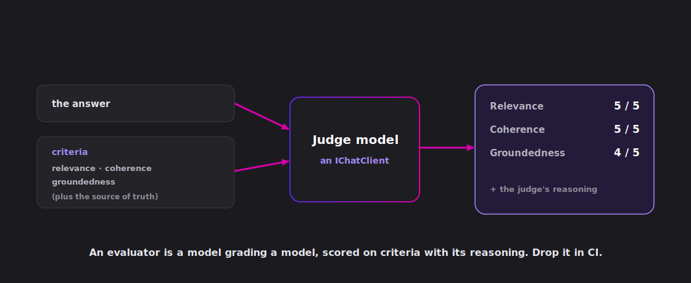
</div>

Note:
This one sounds strange the first time: a model grading a model. Here's how it works. You give a judge model the answer plus your criteria, relevance, coherence, groundedness, and for groundedness the source of truth. The judge scores each one and tells you why. Then you automate it, run it in CI, and score every change so quality never quietly slips. Now the code.

--

<div class="diagram">
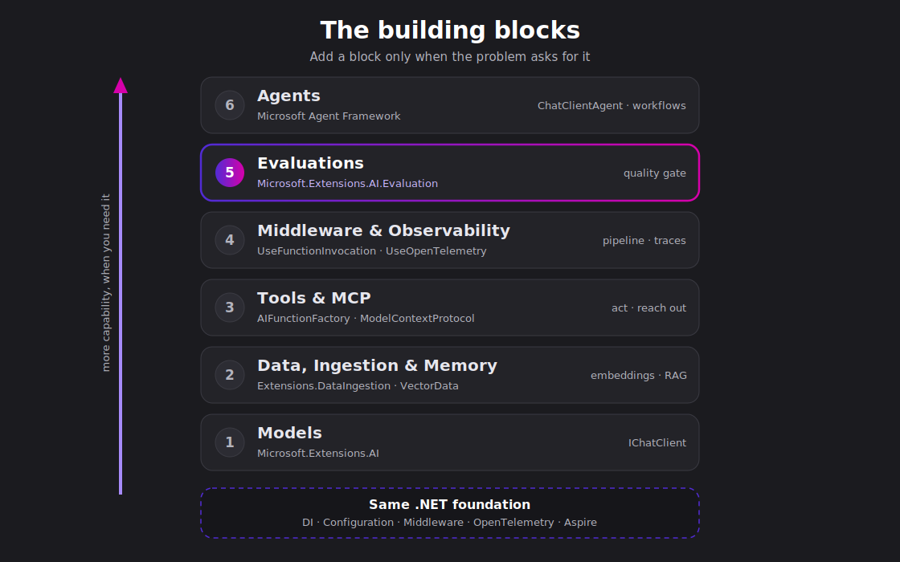
</div>

Note:
Five blocks. We've got a grounded, observable, tested app. There's one block left, and it's the one everybody's asking about.

---

<span class="kicker">Block 6 · Agents</span>

## An agent is the blocks, wrapped

<div class="diagram">
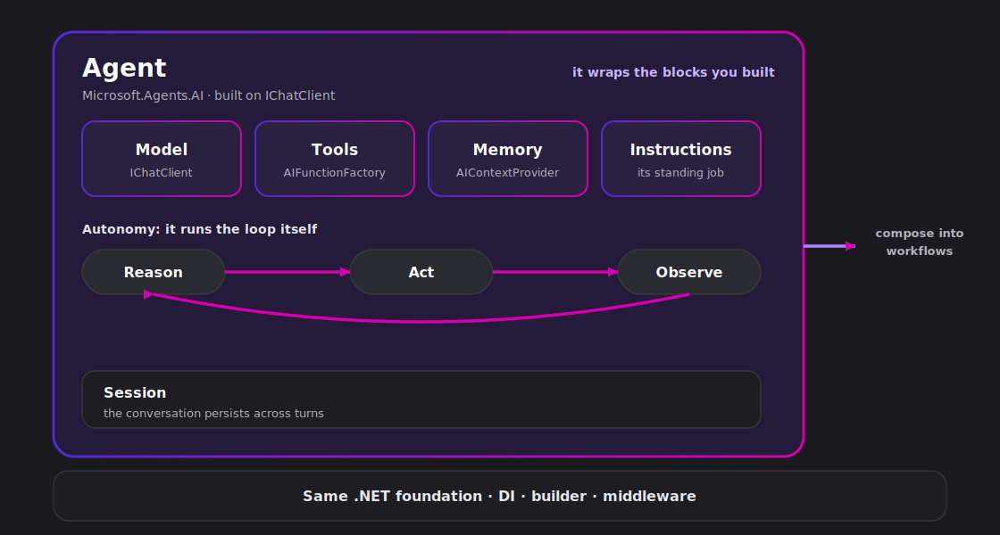
</div>

Note:
So, what is an agent? A chatbot takes your input, calls the model, and hands back the output. You orchestrate every step. An agent has autonomy. It reasons about the task, picks a tool, calls it, looks at the result, and decides what to do next, on its own.
Here is the part that matters for this talk. An agent is not a new thing to learn. It is the blocks you already built. The model is the IChatClient from block one. The tools are the AIFunctionFactory functions from block three. Memory is an AIContextProvider, and it can pull from the same vector store you saw in block two. Instructions are the agent's standing job, and middleware still wraps the calls underneath. The agent draws a boundary around all of it and adds the loop.
And it sits on the same .NET foundation: dependency injection, the builder, configuration. So when we wrap an IChatClient as an agent on the next slide, there is no new mental model. It is encapsulation, not a rewrite.

--

<span class="kicker">Block 6 · Agents</span>

## From blocks to agents, one line

<div class="cols">
<div class="col-left">

You just saw what an agent wraps. Here it is in code. You already have an `IChatClient` and tools, so wrap them as a `ChatClientAgent`. That's Microsoft Agent Framework. No rewrite.

<div class="badges">
<span class="badge ext">Microsoft.Agents.AI</span>
<span class="badge">same IChatClient</span>
</div>

<span class="run">dotnet run 10-agent.cs</span>

</div>
<div class="col-left">

```csharp
AIAgent agent = new ChatClientAgent(
    chat,
    instructions: "You are a .NET event planner.",
    name: "Planner",
    tools: [AIFunctionFactory.Create(DaysUntil)]);

AgentResponse first =
    await agent.RunAsync("Days until Dec 25th?");

AgentSession session = await agent.CreateSessionAsync();
// the session remembers across turns
```

</div>
</div>

Note:
We just defined the agent. Now here it is in one line of code, the graduated moment the whole talk has been building toward.
You already have an IChatClient and tools, so you just wrap them. One line. new ChatClientAgent. That's Microsoft Agent Framework.
No new mental model, no rewrite. A session carries the conversation so it remembers across turns. This is why we spent the whole talk on the foundation. Moving to agents is a wrap, not a rebuild.

--

<span class="kicker">Block 6 · Multi-agent</span>

## Compose agents like middleware

<div class="cols">
<div class="col-left">

One agent is enough until the work has parts. Then you compose them. A concurrent workflow fans out to specialists and fans the results back in.

<span class="run">dotnet run 11-multi-agent.cs</span>

</div>
<div class="col-left">

```csharp
Workflow workflow = AgentWorkflowBuilder.BuildConcurrent(
    [technical, product, risk],
    aggregator: outputs => Summarize(outputs));

// a workflow runs through the same agent interface
AIAgent panel = workflow.AsAIAgent(name: "ReviewPanel");

AgentResponse review = await panel.RunAsync(proposal);
```

</div>
</div>

<p class="repeat-beat">One converged framework · local-first · deploy to Foundry</p>

Note:
And when one agent isn't enough, you compose them, the same way you composed middleware.
Here three reviewers, technical, product, and risk, look at one proposal at the same time, and we gather their notes. That's a concurrent workflow: fan out, fan in.
The nice part: the workflow becomes an AIAgent through the same interface. Compose, don't rewrite. And one more thing to say out loud: this is one converged framework. If you used Semantic Kernel or AutoGen, that work lives on here, in Microsoft Agent Framework. Local-first to build, deploy to Foundry when you're ready.

--

<div class="diagram">
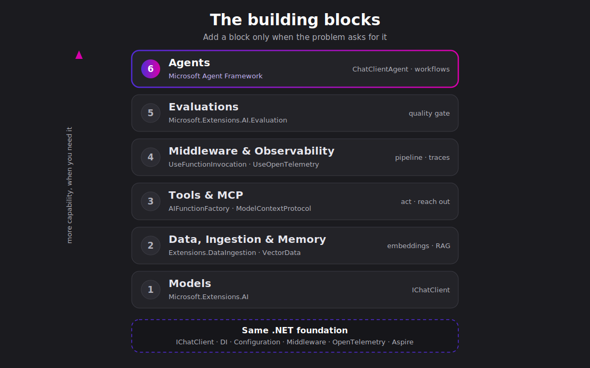
</div>

Note:
All six blocks lit. That's the whole stack, and you watched it get built one runnable sample at a time. Now let me show you what it looks like when somebody already assembled it for you.

---

<span class="kicker">Everything together</span>

## The .NET AI Chat Template

<div class="diagram">
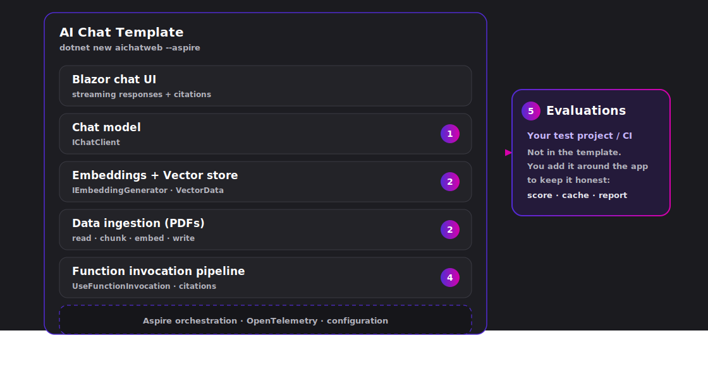
</div>

Note:
This is the production .NET AI Chat Template. One command in the CLI or Visual Studio and you get a real app: a Blazor chat UI, ingestion, a vector store, grounded RAG, the middleware pipeline, all wired up with Aspire.
And here's the thing I want to land. Point at any piece of this app. The IChatClient? That's block one. The embeddings and vector store? Block two. Tools, middleware, telemetry? Blocks three and four. You've already seen every one of these.
The template is just the blocks, assembled. And evaluations plugs in right here, at the test and CI layer, keeping the whole thing honest.

--

<span class="kicker">Try it</span>

## Scaffold and run

<span class="run">dotnet new install Microsoft.Extensions.AI.Templates</span>

<span class="run">dotnet new aichatweb -o MyChatApp --aspire</span>

<span class="run">dotnet run</span>

<p class="muted small">Pick your provider: GitHub Models, Azure OpenAI, OpenAI, or Ollama. Same building blocks underneath.</p>

Note:
You don't have to take my word for it. Install the templates, scaffold an aichat app, run it. Two minutes.
On the way out it asks which provider you want. GitHub Models to start for free, Azure OpenAI for production, OpenAI, or Ollama to run local. Doesn't matter, because underneath it's the same building blocks we just walked through, and the same IChatClient seam lets you switch later.

---

<span class="kicker">What's next</span>

## Upgrade the defaults

<p class="primer-cue">New to advanced ingestion or retrieval? Two 20-second detours below.</p>

<div class="diagram">
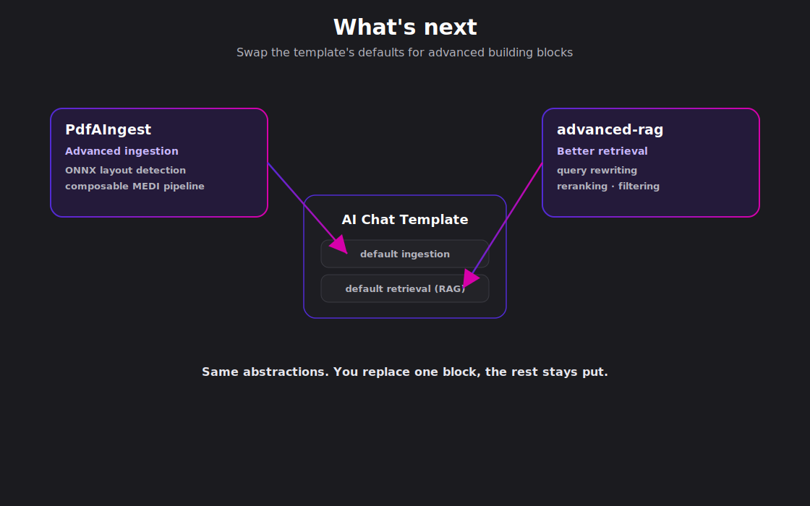
</div>

Note:
Two upgrades worth knowing about, and they're about problems, not products.
First problem: real documents are messy. The template handles simple files, but production PDFs have layout, tables, and images. The fix is a composable ingestion pipeline, reader to chunker to enricher to writer, that chunks by meaning and enriches each piece. Every step swappable. For layout-aware PDFs with ONNX detection, there's a worked example called PdfAIngest.
Second problem: default top-k retrieval is rarely good enough. Advanced retrieval adds reranking, filtering, and query rewriting. There's an advanced-rag sample to go deeper.
The point is the shape. Because the blocks are swappable, these aren't rewrites. You replace one default and keep everything else. Which is exactly what I'll show you next.

--

<span class="kicker">What's next · In plain terms</span>

## What's advanced ingestion?

<div class="diagram">
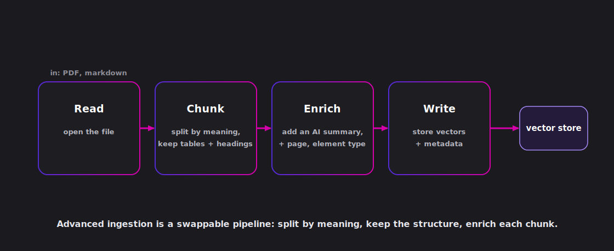
</div>

<p class="muted small">Built in the open: `Microsoft.Extensions.DataIngestion` · dotnet/extensions #7516</p>

Note:
If advanced ingestion sounds fuzzy, here's the plain version. Real documents are messy: a PDF has tables, columns, and headings, not clean paragraphs. So instead of dumping the raw text and slicing it by character count, you run a small pipeline. Read the file, chunk it by meaning so a table or a section stays whole, enrich each chunk with a short AI summary and metadata like the page number and element type, then write it to the store. Every step is swappable. This is Microsoft.Extensions.DataIngestion, MEDI, and we're building it in the open: the chunk-metadata work is dotnet/extensions PR 7516, with community processors in CommunityToolkit/AI. Want it taken all the way to ONNX layout detection on PDFs? That's the PdfAIngest sample.

--

<span class="kicker">What's next · In plain terms</span>

## What's advanced retrieval?

<div class="diagram">
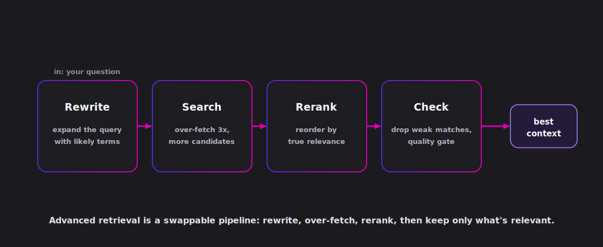
</div>

<p class="muted small">Built in the open: `Microsoft.Extensions.DataRetrieval` · dotnet/extensions #7508</p>

Note:
And advanced retrieval, in plain terms. Default retrieval embeds your question and grabs the nearest top-k chunks, which is often not enough. So you add steps. Rewrite the question with likely document terms, so the search matches the way the docs are actually written. Over-fetch, grab more candidates than you need. Rerank them by true relevance. Then check, drop the weak matches with a quality gate. The result is the best context for the model. This is the new Microsoft.Extensions.DataRetrieval abstraction, proposed in dotnet/extensions issue 7507 and added in PR 7508, with an ONNX reranker and more in CommunityToolkit/AI. The advanced-rag reference app composes the whole thing.

---

<span class="kicker">The final demo</span>

## Upgrade, not rewrite

<div class="cols">
<div class="col-left">

Same template. Two blocks swapped: layout-aware ingestion and better retrieval. Everything else stays put.

<span class="run">git diff main..advanced-demo</span>

<p class="muted small">The diff is the whole point. A few changed components, not a new app.</p>

</div>
<div class="col-left">

- `main` — the scaffolded template, default ingestion and RAG
- `advanced-demo` — same app, advanced ingestion + advanced retrieval

Run it on a real PDF and watch the grounding improve.

</div>
</div>

<p class="repeat-beat">Swap a default · keep everything else · same foundation</p>

Note:
This is the payoff for the whole swappable-blocks story, live. I took the template you just saw, made a branch called advanced-demo, and changed exactly two things: the ingestion got layout-aware, and the retrieval got smarter.
Then look at the diff. Main versus the branch. It's small. A few components swapped, the Blazor UI and the wiring untouched. That's the thesis on screen: upgrading an AI app is changing a block, not starting over.
I'll run the branch on a real PDF so you can see the same questions get better-grounded answers.

---

<span class="kicker">Recap</span>

## You already knew how to do this

<div class="blocks">
<div class="block-card active"><div class="num">01</div><div class="name">Models</div><div class="pkg">Extensions.AI</div></div>
<div class="block-card active"><div class="num">02</div><div class="name">Data &amp; memory</div><div class="pkg">Extensions.<wbr>VectorData</div></div>
<div class="block-card active"><div class="num">03</div><div class="name">Tools &amp; MCP</div><div class="pkg">Model<wbr>Context<wbr>Protocol</div></div>
<div class="block-card active"><div class="num">04</div><div class="name">Middleware</div><div class="pkg">OpenTelemetry</div></div>
<div class="block-card active"><div class="num">05</div><div class="name">Evaluations</div><div class="pkg">Extensions.AI.<wbr>Evaluation</div></div>
<div class="block-card active"><div class="num">06</div><div class="name">Agents</div><div class="pkg">Agents.AI</div></div>
</div>

<p class="lead">Building blocks for the AI age, and they're already part of .NET.</p>

Note:
Let's bring it home. Six blocks. Models, data and memory, tools and MCP, middleware, evaluations, agents.
Every one is built the .NET way. Every one uses the DI, builder, and middleware patterns you already know. Every one sits on the same IChatClient foundation and on open standards. So moving from a single model call all the way to a multi-agent workflow was adding blocks, never starting over.
Building blocks for the AI age, and they're already part of .NET. You learn it once and use it everywhere.
And that's the deal we make with you on the .NET team. We ship the building blocks and keep them open. You build on them. Your skills and your code carry forward as the AI space keeps moving.

---

<span class="kicker">Resources</span>

## Try → Learn → Tell us

<div class="cols">
<div class="col-left">

**Try**
<span class="run">dotnet new aichatweb -o MyChatApp --aspire</span>

**Learn**
- The .NET + AI hub: `learn.microsoft.com/dotnet/ai`
- All eleven samples in this repo

</div>
<div class="col-left">

**This talk + samples**
`github.com/luisquintanilla/dotnet-ai-building-blocks-models-to-agents`

**Tell us**
Open an issue with what you build, or what's missing.

<div class="badges">
<span class="badge ext">Microsoft.Extensions.*</span>
<span class="badge open">open standards</span>
</div>

</div>
</div>

Note:
Three ways to take this further. Try: scaffold the template today. Learn: the dotnet slash ai hub is the map, and every sample from this talk is in the repo so you can run them yourself. Tell us: open an issue with what you build or what's missing, because that's how these blocks keep getting better.
Grab the repo link, and let's open it up for questions.

---

<div class="title-slide">

<div class="title-rule"></div>

# Questions?

<p class="subtitle">From Models to Agents: The Essential Building Blocks of AI Apps</p>

<p class="byline">Luis Quintanilla &nbsp;·&nbsp; github.com/luisquintanilla</p>

</div>

Note:
Thank you. I've got about fifteen minutes, so let's get into your questions. If you want to follow along, the repo link is on the previous slide and everything we ran today is in there.
